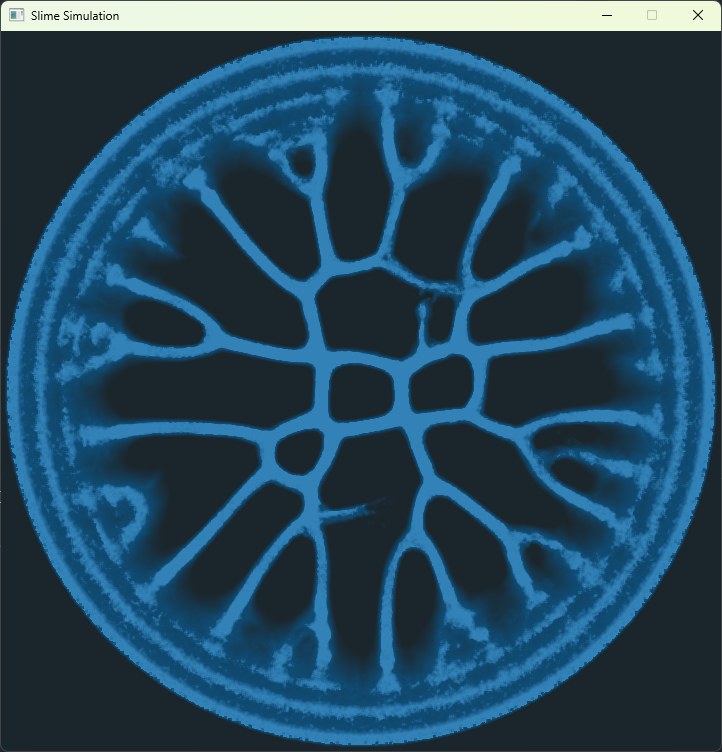
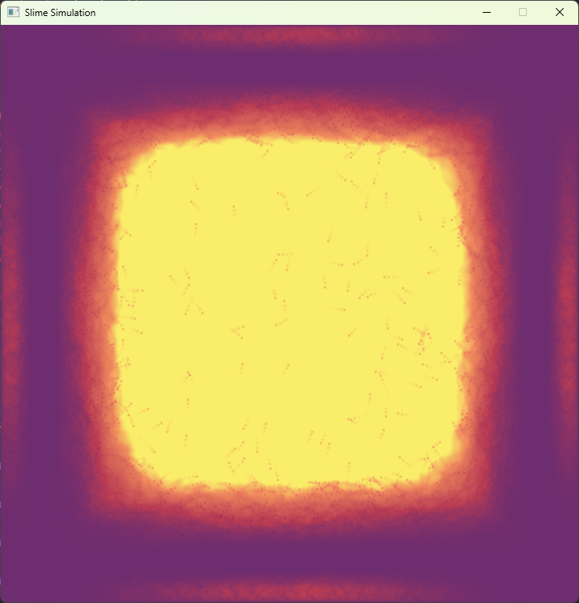
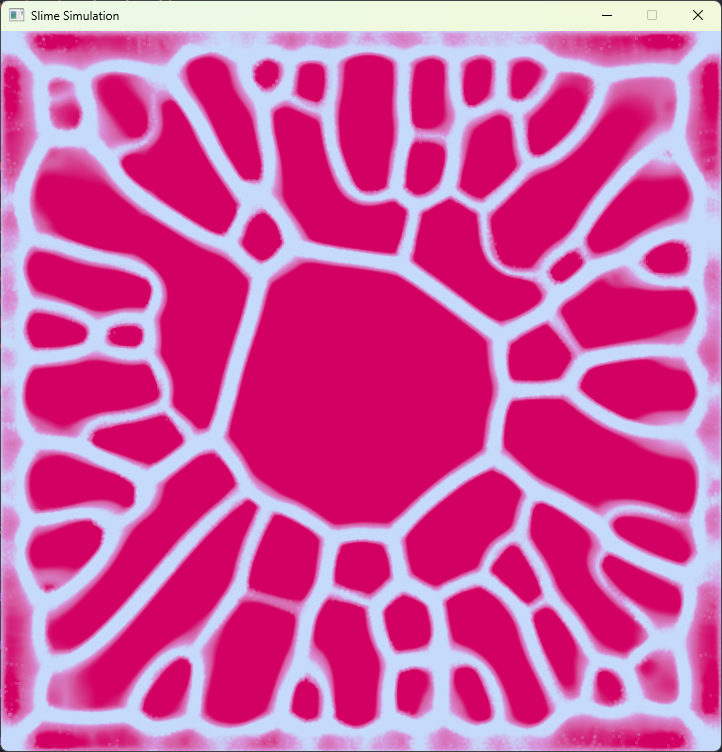
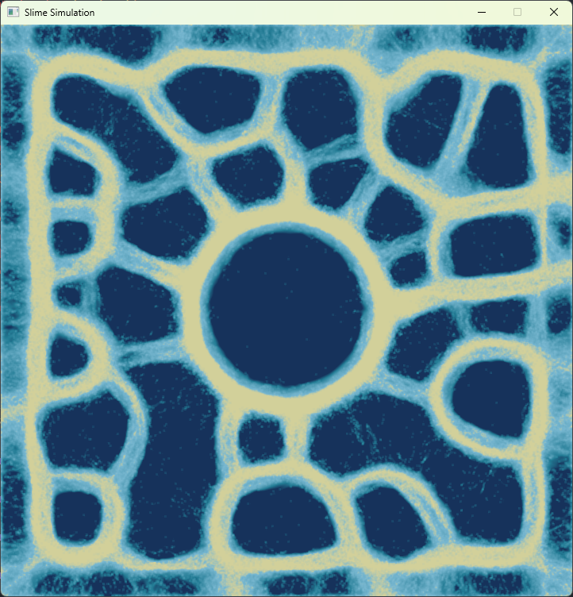

# Slime Mold Simulation



This Go project simulates the movement of slime molds on a 2D grid. The slime mold's behavior is influenced by various parameters such as speed, trail dynamics, and random forces. The project also supports customization of the color gradient used to visualize the trails left behind by the slimes.

## Configuration

You can adjust the simulation settings in the `config.go` file. Below is an example configuration:

```go
var darkBlueGradient = Gradient{
	colors: []GradientStop{
		fromHex("#1b262c", 0),
		fromHex("#0f4c75", 0.85),
		fromHex("#3282b8", 0.95),
		fromHex("#bbe1fa", 1),
	},
}

var config = Config{
	sizeX:                      720,      // Width of the simulation grid
	sizeY:                      720,      // Height of the simulation grid
	numOfSlimes:                1_000_000, // Number of slime agents
	slimeDefaultSpeed:          2,        // Base speed of each slime
	slimeSpeedRandomness:       0.5,      // Random variation in slime speed
	worldDecrementSpeed:        0.05,     // Rate at which the world trails fade
	trailSampleDirectionOffset: 0.9,      // Offset for sampling trail direction
	trailSampleDirectionLength: 20,       // Distance for sampling trails
	trailTurnForce:             1.2,      // Force applied when turning along a trail
	trailRandomTurnForce:       0.15,     // Random turn force applied to each slime
	trailSampleSize:            1,        // Size of trail sample areas
	startCircleSize:            5.0,      // Radius of the initial spawn circle for slimes
	startTowardsCenter:         true,     // If true, slimes will initially move towards the center
	gradient:                   darkBlueGradient, // Color gradient for trail visualization
}
```

### Customizing the Gradient

The `gradient` parameter allows you to change the color gradient used to visualize the trails left by the slime molds. You can modify the `colors` slice in the `Gradient` struct to define different stops along the gradient.

### Example: `darkBlueGradient`

This example uses a gradient from dark blue to light blue, with varying levels of transparency.

```go
var darkBlueGradient = Gradient{
	colors: []GradientStop{
		fromHex("#1b262c", 0),   // Dark blue
		fromHex("#0f4c75", 0.85), // Medium blue
		fromHex("#3282b8", 0.95), // Light blue
		fromHex("#bbe1fa", 1),    // Very light blue
	},
}
```

## How to Run

1. Install Go from [the official Go website](https://golang.org/dl/).
2. Clone this repository:
   ```bash
   git clone https://github.com/Hawaii66/slime-mold-simulation.git
   ```
3. Navigate to the project directory:
   ```bash
   cd slime-mold-simulation
   ```
4. Install dependencies:
   ```bash
   go mod tidy
   ```
5. Run the simulation:
   ```bash
   go run main.go
   ```

## Features

- **Adjustable simulation parameters**: Fine-tune the slime mold behavior by modifying speed, randomness, and trail dynamics in the configuration.
- **Gradient-based visualization**: Use a customizable color gradient to visualize the slime trails.

## Performance

This simulation supports running up to **1,000,000 slime agents** concurrently. To achieve smooth performance, the following optimizations are in place:

- **Map Blurring with Goroutines**: The simulation blurs the world map by dividing it into smaller chunks and processes them concurrently using Go's goroutines. This parallel processing ensures efficient blending of the slime trails across the map.
- **Concurrent Slime Processing**: Slime agents are processed in parallel using goroutines. Since slime agents only require read access to the world map (e.g., for trail detection), the simulation can handle many agents simultaneously without conflicts, leveraging Go’s concurrency model to maximize performance.

These optimizations make the simulation highly scalable and efficient, even with a large number of agents.

## Visual Examples

Below are some visual examples of the slime mold simulation using different gradient configurations:

- **Blue Gradient**:  
  A smooth transition from dark to light blue, giving a calm and cool aesthetic.

  

- **Sunset**:  
   A warm, dynamic gradient inspired by sunset colors, blending oranges, purples, and reds.

  

- **Red sky**:  
  A vibrant red gradient that highlights the trails with a striking contrast.

  

- **Blue Yellow**:  
  A harsh contrast between yellow and blue.

  

These images showcase the versatility of the slime trail visualization by adjusting the gradient in the configuration. You can easily experiment with your own gradients to create different visual effects.
